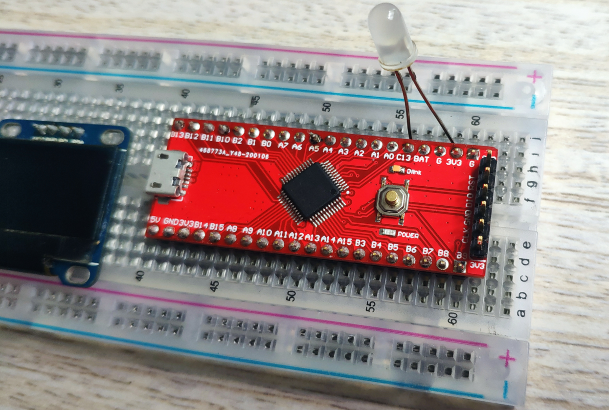

# MySTM32F103C8 v1.1 - Hardware

一个大小53.34mm*20.32mm STM32F103C8核心板，所有GPIO引脚都引出。

Size 53.34mm*20.32mm, STM32F103C8 core board, all GPIO pins are led out.

Folder  Output Files

- MySTM32F103C8 v1.1 - PCB.zip  (Gerber Files)
- MySTM32F103C8 v1.1 PCB BOM.xlsx
- MySTM32F103C8 v1.1 SMT贴片图.pdf
- MySTM32F103C8 原理图 v1.1.pdf

拿走不谢，留个署名就好。